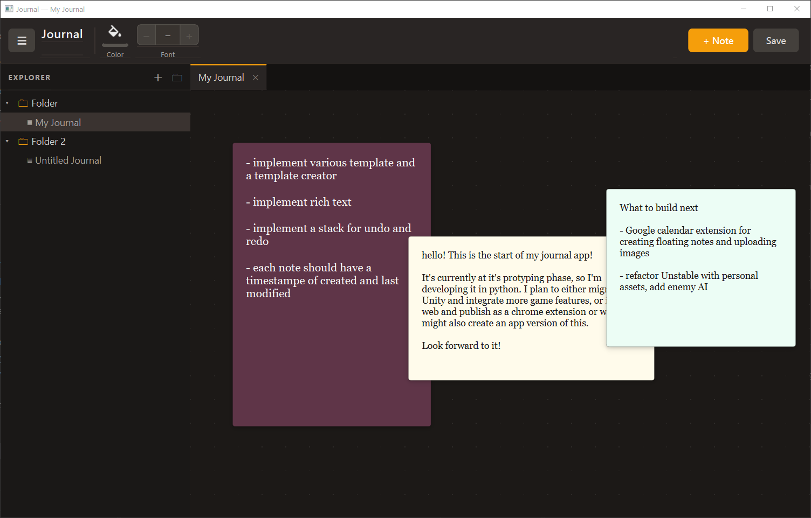
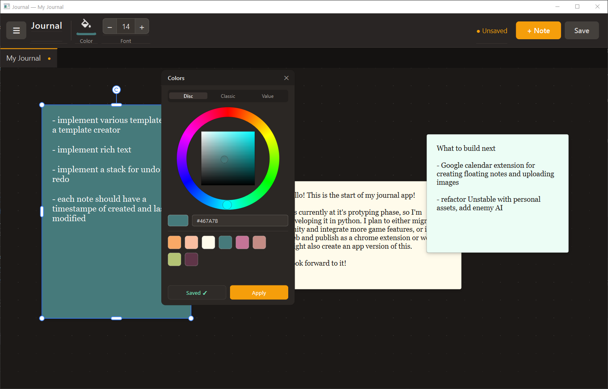
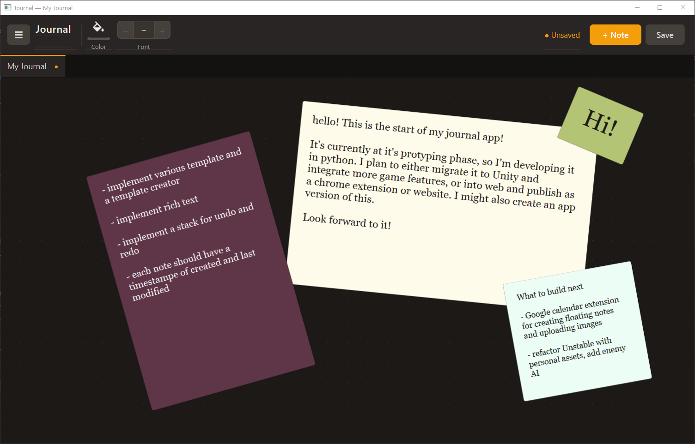

# Mood Board Journal

A desktop journal and mood-board app for arranging free-form sticky notes on
separate journal canvases. Built with Python and PyQt6.

## At a glance



The explorer keeps journals organised into folders while each open journal gets
its own tab and canvas.

## Features

- **Explorer sidebar** — create nested folders and journals, rename them
  inline, and drag to reorganize the tree
- **Tabbed journals** — open multiple independent canvases in VS Code-style
  tabs; each journal saves to its own file
- **Sticky notes** — create by double-clicking the workspace, dragging out an
  area, using `Ctrl+N`, or the toolbar; drag, resize, rotate, and layer them
- **Focused editor** — double-click a note to edit it in a full-window overlay
- **Colour workflow** — choose colours with Disc, Classic, or Value pickers;
  save favourite swatches to a global palette
- **Layer controls** — `Shift+Up` / `Shift+Down` move a selected note one layer;
  `Ctrl+Shift+Up` / `Ctrl+Shift+Down` send it to the front or back
- **Explicit saves** — `Ctrl+S` saves the current journal and a dirty marker
  shows unsaved work
- **Persistent library** — library structure, journals, and app settings are
  stored under `~/.journal_app/`

## Run

```bash
python main.py
```

Requires Python 3.12+ and PyQt6.

## Controls

| Action | Control |
| --- | --- |
| New note | `Ctrl+N`, toolbar, double-click, or drag on empty workspace |
| Edit a note | Double-click the note |
| Save current journal | `Ctrl+S` |
| Toggle explorer | `Ctrl+B` |
| New journal | `Ctrl+Shift+N` |
| Close journal tab | `Ctrl+W` |
| Zoom interface | `Ctrl+=`, `Ctrl+-`, `Ctrl+0` |

## Customise and arrange



Choose a colour, save it to the shared palette, and use the selection frame to
resize or rotate a note.



Notes remain free-form, so each journal can be laid out as a board rather than
a fixed document.

## Architecture

MVC split: plain dataclass models, `QObject` controllers that emit signals, and
PyQt6 views. See [CLAUDE.md](CLAUDE.md) for the architecture, design decisions,
and roadmap.
